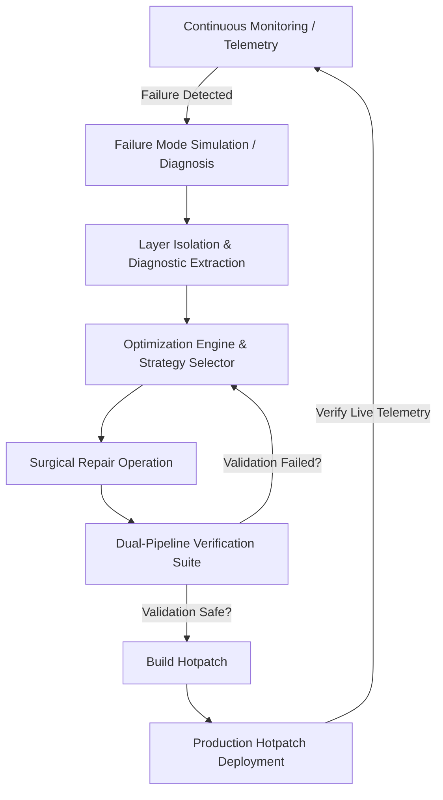

# 🧠 UniRepairNet

> **Unified Framework for Automated Diagnosis and Repair of Deep Neural Networks (DNNs) Against Multiple Failure Modes**

UniRepairNet is a Next.js-based interactive dashboard designed for machine learning engineers and MLOps operators. It provides a visual playground to monitor model health, simulate common production failures, optimize repair strategies, run automated dual-verification suites, and deploy hotpatches in real-time.

---

## 🚀 Key Features

- **📊 Real-time System Telemetry**: Monitors model confidence, GPU utilization, memory footprint, inference latency, drift score, and bias score with dynamic visualization.
- **⚡ Multi-Failure Simulation Engine**: Simulates five critical failure modes on the fly:
  - *Adversarial Attacks* (evasion perturbations)
  - *Concept Drift* (feature and label space shifting)
  - *Demographic Bias* (subgroup fairness degradation)
  - *Backdoor Exploits* (trigger activations)
  - *Random Noise / Hardware Degrades*
- **🎛️ Optimization & Strategy Selector**: Recommends mitigation strategies (Surgical Fine-tuning, Masked Pruning, Low-Rank Adaptation, Safety Guardrails) by solving optimization constraints across key weights:
  - $\alpha$ (Task Accuracy)
  - $\beta$ (Repair Cost)
  - $\gamma$ (Complexity Penalty)
  - $\delta$ (Safety Boundary Bounds)
- **🧱 Neural Layer Sandbox**: Interactive layer visualizer representing standard transformer block projection. Select specific layers (e.g., input embeddings, attention blocks, classifiers) to run repair operations: `weight tuning`, `activation masking`, `node freezing`, `low-rank (LoRA) projection`, `parameter reset`, or `gradient constraints`.
- **🧪 Dual-Pipeline Verification**: A rigorous testing suite verifying accuracy, precision, recall, F1-score, and latency on parallel pipelines (Suite A & Suite B) with terminal output feeds.
- **🚢 Hotpatch Deployment**: Deploys the generated repair patch directly to the model pipeline with live compilation logs.

---

## 🛠️ Tech Stack

- **Framework**: [Next.js 16 (App Router)](https://nextjs.org/)
- **Core Library**: [React 19](https://react.dev/)
- **Styling**: [Tailwind CSS v4](https://tailwindcss.com/) & Vanilla CSS with modern Glassmorphic effects
- **Animations**: [Framer Motion](https://www.framer.com/motion/)
- **Icons**: [Lucide React](https://lucide.dev/)
- **Interactivity**: [Canvas Confetti](https://github.com/catdad/canvas-confetti)
- **Language**: [TypeScript](https://www.typescriptlang.org/)

---

## 📂 Project Structure

```text
unirepairnet/
├── src/
│   └── app/
│       ├── page.tsx          # Main interactive dashboard container
│       ├── layout.tsx        # Base HTML layout, fonts & metadata configuration
│       ├── globals.css       # Custom scrollbars, glassmorphism panel styles, and glow animations
│       └── favicon.ico       # Application icon
├── public/                   # Static assets
├── next.config.ts            # Next.js configuration
├── tsconfig.json             # TypeScript compiler settings
├── package.json              # Project dependencies and script runner configurations
└── README.md                 # Project documentation (this file)
```

---

## 🔄 Architectural Workflow

The diagnostic and repair pipeline operates in a closed-loop system:



---

## ⚡ Getting Started

### Prerequisites

Ensure you have [Node.js](https://nodejs.org/) installed (version 18+ recommended) along with standard package managers.

### Installation

Clone the repository, navigate to the directory, and install dependencies:

```bash
# Install dependencies
npm install
```

### Development Server

Run the local development server:

```bash
npm run dev
```

Open [http://localhost:3000](http://localhost:3000) in your browser to interact with the dashboard.

### Build and Production Deployment

To create an optimized production build of the project:

```bash
# Build the production application
npm run build

# Start the production server
npm run start
```

### Linting

To run static linting checks:

```bash
npm run lint
```

---

## 🧬 Diagnostic Control Panel Reference

| Component / Setting | Description |
| :--- | :--- |
| **Optimization Weights ($\alpha, \beta, \gamma, \delta$)** | Controls how the optimizer balances accuracy retention vs. repair computational cost. |
| **Neural Layers Status** | Color-coded nodes indicating health status (`Nominal`, `Degraded`, `Isolated`, `Repaired`). |
| **Verification Badge** | Visual state showing the safety of the current patch (`idle`, `solving`, `safe`, `authorized`, `warning`, `counterexample`). |
| **Terminal Logs** | Continuous execution stream displaying MLOps cluster performance, optimization metrics, and compile-stage statuses. |
